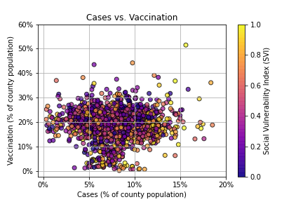
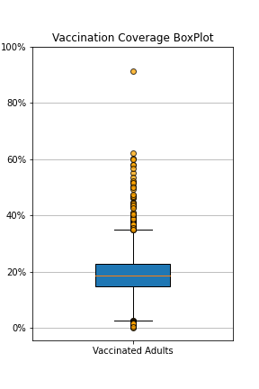
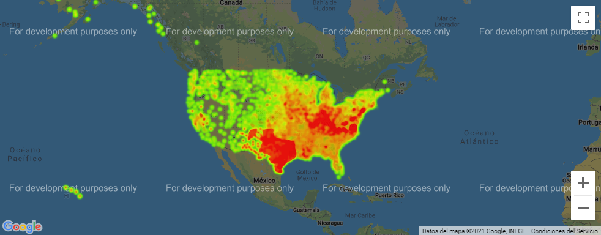

# Project 1: Covid-19 Vaccination Campaign in the US

## Contributors
* Ana Juárez
* María Inés Oñate
* Mariana Geffroy López
* Ricardo Pérez

## Project Description/Outline

The scope of this study is to determine the effectiveness of the US vaccination campaign in attending the population that is most affected by covid-19 disease. This is achieved by revising the total number of doses applied, vaccination coverage, population demographics such as gender, race, socioeconomic status, and education, versus epidemiologic variables: incidence, prevalence, hospitalization, UCI, death numbers.

## Research question
### Is the vaccination roll-out campaign covering the population most affected by covid-19 in the United States?

## Follow up questions

* Which are the variables that could describe risk/affected populations? 
* How can we confirm if vaccination campaigns and coverage are being applied to these populations?
* How do we measure the most affected counties?→ number of new infections (incidence)
* How do we measure risk populations? →  Use of social vulnerability index (SVI)
* How can we confirm if vaccination campaigns and coverage are being applied to these populations?
* How do we measure vaccination coverage? → Percent of total population vaccinated
* Which will be our population of study? → US Counties

## Project Folder 
### Index 
+ **Project Proposal**
   - https://docs.google.com/document/d/1ccgrN0LmAATHM0wrPo6OQ3clvzeYnQ_-r2q8SMwciCA/edit?usp=sharing
+ **White paper**
   - https://docs.google.com/document/d/1UPLd5xbPfAK9bMrdlEcb-gs6C2U-yQTLkZvhf70ggmM/edit?usp=sharing
+ **Presentation** 
   - https://docs.google.com/presentation/d/1JYUu2L8ZPqYlXaxa46UvYFYL6I6oJe5IQVBFXseV0i0/edit?usp=sharing

## Data Input

The `data_input` folder on local repository must contain the following files:

+ **Data.CDC.gov:** Vaccine Hesitancy for COVID-19: County and local estimates
   - *Vaccine_Hesitancy_for_COVID-19__County_and_local_estimates.csv*
   - https://data.cdc.gov/api/views/q9mh-h2tw/rows.csv?accessType=DOWNLOAD&api_foundry=true

+ **United States Census Bureau:**
   - *cc-est2019-alldata.csv*
   - https://www2.census.gov/programs-surveys/popest/datasets/2010-2019/counties/asrh/cc-est2019-alldata.csv
   - *co-est2019-alldata.csv*
   - https://www2.census.gov/programs-surveys/popest/datasets/2010-2019/counties/totals/co-est2019-alldata.csv

+ **simplemaps:** United States Cities Database (https://simplemaps.com/data/us-cities)
   - *uscities.csv*
   - https://simplemaps.com/static/data/us-cities/1.73/basic/simplemaps_uscities_basicv1.73.zip

## Data Cleanup & Exploration

1. Data architecture
   - Explore selected datasets
   - Define common key to merge data (by county)
2. Data retrieval
   - Download datasets (csv) / Request data (api)
   - Build DataFrames
   - Select / discard data fields 
3. Data cleaning
   - Validate & Standardize data (header, type, format)
   - Remove invalid values
   - Convert available data into processable values
   - Index data
4. Data processing
   - Filter, group & unstack data
   - Merge datasets → Build Analysis Datasets
   - Store Analysis Datasets (csv)

## Data Visualization

| Counties Incidence Timeline | Vaccinated Population by Age Group |
| --- | --- |
|  |  |

| Cases vs. Vaccination vs. SVI | Linear regression results |
| --- | --- |
|  |  |

| Heatmap Overlay (Vaccination vs SVI) |
| --- |
|  |

## Difficulties

* Case surveillance dataset (Covid cases by county)
  - 4.7 million entries = 3 Gb csv file 
  - We bumped into a lot of API restrictions (app token, throttling limits)
  - It had it’s own language Socrata Query Language (SoQL)
Solution: lots of trial & error, python time.sleep()

* Significant amount of missing and NA values in many rows.
  - Conflicts with the Sample size vs Population
Solution: dropna(), !=0

* CDC datasets
  - Data that doesn't match any county or state so that information and, therefore, can’t be pointed out to a specific place.
  - Many counties without information because of the lack of informations in some states. 
Solution: “if life gives you lemons…” We did the best with what we had. 

## Hypothetical future steps (If we had more time)

* Why is there a low vaccination coverage cluster? (counties with 5-10% affected population).
* Is the vaccine rollout & affected population different depending on other variables:
  - Political preference (Democrats vs Republicans).
  - Reluctancy to wear masks.

## Notes
1. For adequate data retrieval and heatmap visualization it is required to have App Token from Data.CDC.gov and Api Key from Google Developers in a `config.py` file on local repository.
2. Jupyter Notebooks `P1.1_Data_Collection.ipynb` &  `P1.2_Data_Analysis.ipynb` are not correctly displayed in the GitHub interface. It is strongly suggested to download these files in order to run them natively.

